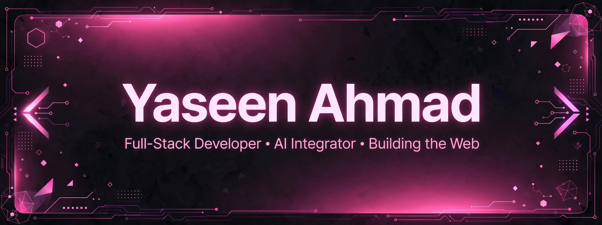
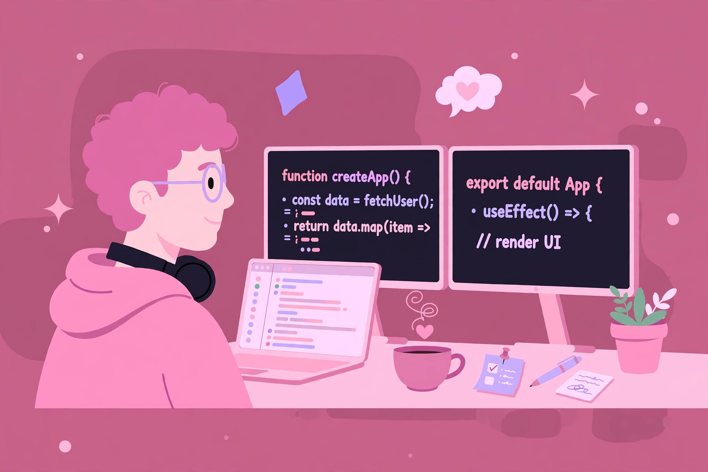

  

<h1 align="center">Hey there, I'm Yaseen Ahmad 👋</h1>

  

  
  
  

---

## 💖 About Me

<table>
  <tr>
    <td width="65%" valign="top">
       
      🎓 Final-year <b>BS Software Engineering</b> student at <b>CECOS University</b>, Peshawar — and Class Representative of my section.  
      💼 <b>Full Stack Development Intern</b> at CECOS IT Services (Private) Limited.  
      🚀 Currently leading the full-stack redesign of the official <b>CECOS University website</b> (Next.js + Supabase + PostgreSQL).  
      🤖 I build things with <b>AI integration</b> — trading trackers, desktop AI apps (Forge), local LLM deployments, and full-stack platforms like <b>YTUBE</b>.  
      🎮 Into Unity/C# 2D game dev, detailed AI prompting, and hardware that keeps up.  
      📍 Based in <b>Peshawar, Pakistan</b> — I ship fast, break things, and fix them faster.
    </td>
    <td width="35%" valign="top">
      
    </td>
  </tr>
</table>

---

## 🛠️ Tech Stack

   
   
  

---

## 📊 GitHub Stats

  
  

  

  

---

## 🐍 Contribution Snake

<picture>
  <source media="(prefers-color-scheme: dark)" srcset="https://raw.githubusercontent.com/MrYaseen0/MrYaseen0/output/github-contribution-grid-snake-dark.svg">
  <source media="(prefers-color-scheme: light)" srcset="https://raw.githubusercontent.com/MrYaseen0/MrYaseen0/output/github-contribution-grid-snake.svg">
  
</picture>

<!-- The snake above is generated by a GitHub Action (.github/workflows/snake.yml) that runs every 12 hours -->

---

## 🔥 Featured Projects

| Project | What it is |
|---|---|
| 🎬 [ytube](https://github.com/MrYaseen0/ytube) | Full-stack YouTube clone — Next.js 14, TypeScript, Tailwind, Supabase |
| 🤖 [uncensored-llm-server](https://github.com/MrYaseen0/uncensored-llm-server) | Qwen3.8-27B uncensored LLM server on Kaggle 2×T4 — one-click notebook |
| 📈 [xau-bot](https://github.com/MrYaseen0/xau-bot) | AI-powered XAUUSD trading tracker with live dashboard + alerts |
| 🖥️ Forge Desktop | Desktop AI app (Python) wired to uncensored LLMs via Cloudflare tunnels |

---

## 📫 Connect With Me

  
  

---

  

